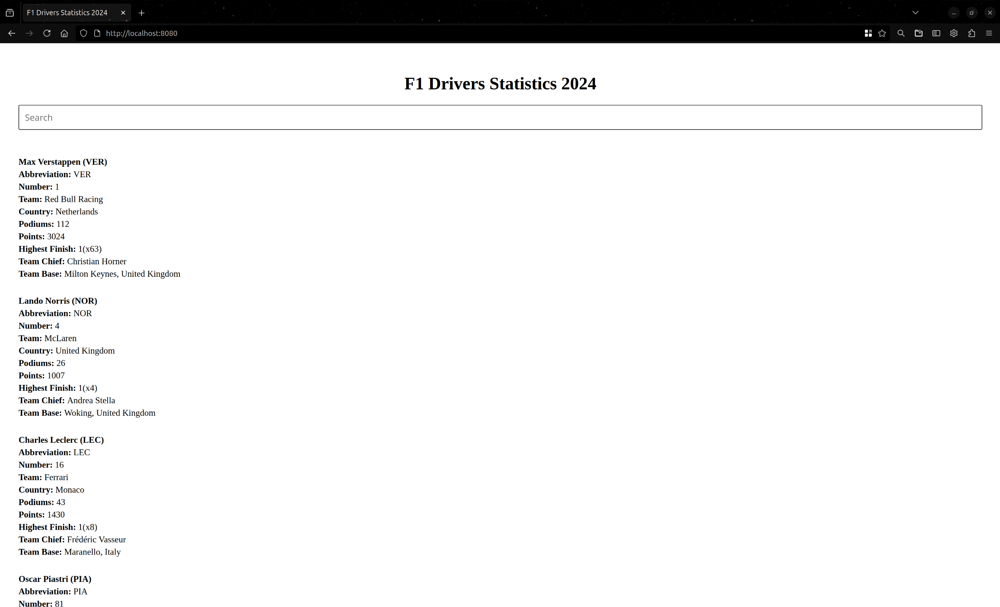

In this full-stack project, I implemented a [Formula 1 Driver Stats website](https://github.com/T-Kalv/Formula-1-Driver-Stats) which is a full-stack Web Application that provides users with information about Formula drivers (2024 season) via a search interface. The backend uses Spring-Boot Java with a PostgreSQL database and the frontend is built with HTML/JS via a web interface. 

## Features:
- Backend:
  - Uses Spring-Boot Java with a PostgreSQL database for the database and backend services to query/search for data
  - REST API that retrieves the Driver statistics information based on user query using API endpoints such as:
    - `GET /api/v1/driver`
    - `GET /api/v1/driver?driverName={name}`
    - `GET /api/v1/driver?abbreviation={abbreviation}`
    - `GET /api/v1/driver?team={team}`
    - `GET /api/v1/driver?country={country}`

- Frontend:
  - Uses HTML/JS with a simple search bar for filtering information such as Driver Name, Team, Country, Base, Team Chief...
  - Display relevant information based on user query for each driver that matches with user query 

The Formula 1 Driver Stats project source code can be accessed via [GitHub](https://github.com/T-Kalv/Formula-1-Driver-Stats)

