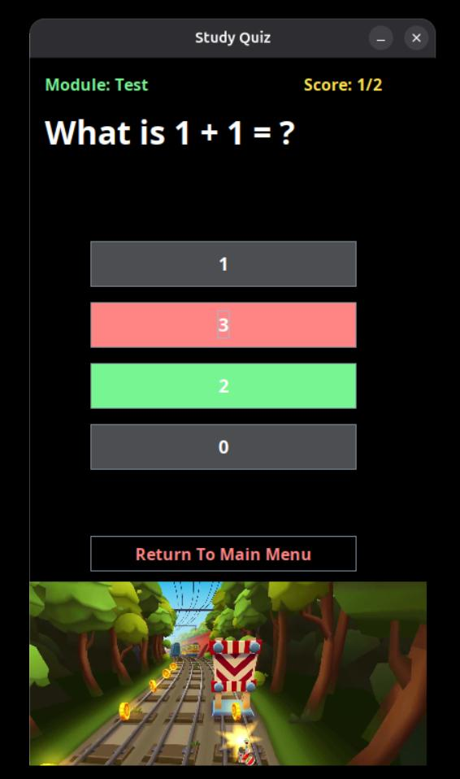

In this project, I implemented [StudyShorts](https://github.com/T-Kalv/StudyShorts) which is a full-stack Java-based Study Quiz Flashcard app that helps users to study whilst testing their knowledge, allowing users to create questions and study those questions engaging with those questions via [short-form video content at the bottom of the screen](https://github.com/T-Kalv/StudyShorts/blob/main/StudyScreen.gif) similar to TikTok/YoutTube Shorts/Instagram Reels...

## Features:
- Frontend:
    - Uses Java Swing framework for the frontend that is response for handling the user input such as clicking buttons, entering information, displaying questions/options/answers and showng scores as well as displaying the short-form video content
- Backend:
    - Uses Java to calculate current score/total score, correct answer verfication, quiz progression, inserting/fetching/deleting information from the MySQL database
    - Uses MySQL database that store data such as questions, options, modules and uses the Java Database Connectivity (JDBC) to fetch the necessary information for the Fronten

## App Study Demo:

The StudyShorts App source code can be accessed via [GitHub](https://github.com/T-Kalv/StudyShorts)

