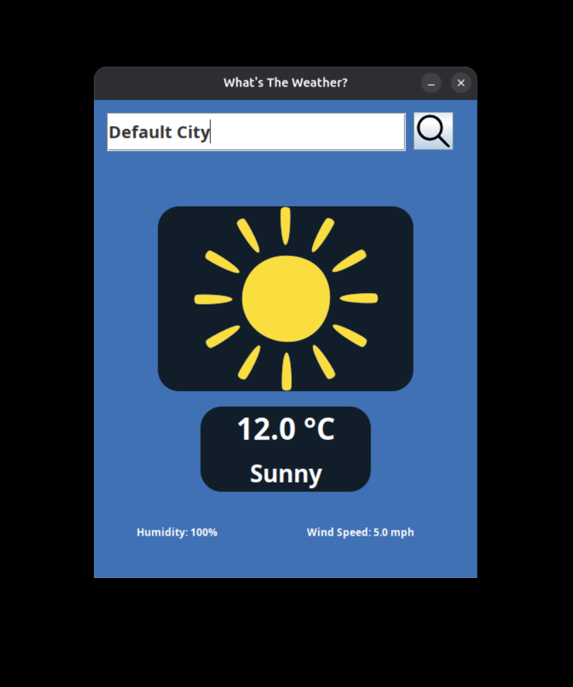

In this full-stack project, I implemented [What's The Weather App](https://github.com/T-Kalv/What-s-The-Weather-) which is a full-stack Desktop App that provides users with the current weather in a certain city with other useful information/metrics such as the current weater condition, tempeature, windspeed, humdity using Weather Forecast API (Open Meteo) and the Swing Java framework...

## Features:
- Frontend:
  - Uses Java Swing framework for the frontend that is response for handling the user input such as clicking buttons, entering city to obtain current weather information via search bar, display current weather conditions...
- Backend:
  - Uses Weather Forecast API (Open Meteo) to fetch current weather condions such as current condition, temperature, windspeed, humdity...
  - Uses Java to implement the backend logic such as parsing JSON calls, performing calls to the Weather Forecast API (Open Meteo) returning the structured weather data...

The What's The Weather App project source code can be accessed via [GitHub](https://github.com/T-Kalv/What-s-The-Weather-)

