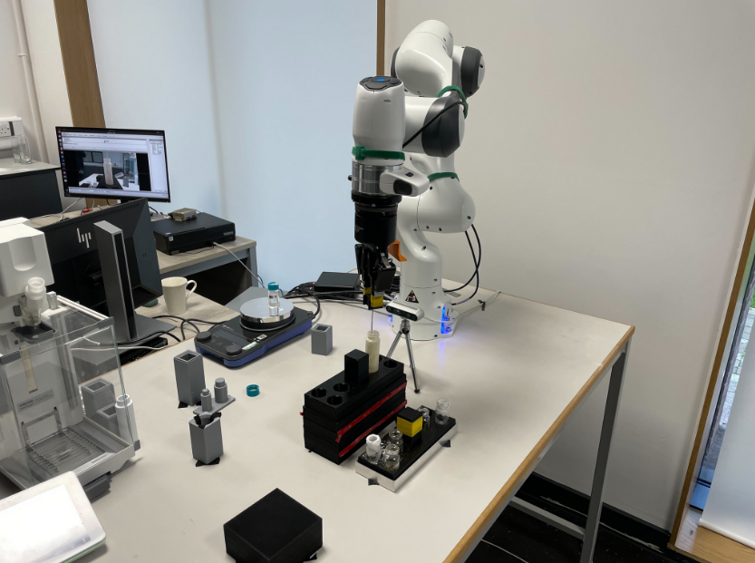

Previously, we explored how artificial intelligence is currently in a transition from static algorithms to continuous **Perception-Action Loops**. We observed this first in the physical space with robotics and then in digital execution environments with multi-agent systems. 

A software agent can experiment code, call APIs and recover from an error without physically damaging* anything. A robot however, has to deal with the real consequences of its subsequent actions. A small error in a movement can cause a collision, break laboratory glassware or completely invalidate an ongoing experiment.

This raises a fundamental question: can we **teach robots physical skills rather than simply programming them to follow fixed instructions?** In this blog, we explore this problem in the research paper *"Accelerating Laboratory Automation Through Robot Skill Learning For Sample Scraping"* by Dr Gabriella Pizzuto and other collaborators.

## Background
Laboratory automation has already enabled robots to perform many repetitive scientific tasks. Such as from handling samples to carrying out predefined experimental procedures. However, these integrated systems have often relied on carefully programmed trajectories and struggle when a task requires adaptation to changes in its environment or physical interaction with objects such as new task or modified task is presented.

For example, scraping material from the inside of a laboratory vial. For us Humans, this is relatively straightforward for us. On the other hand, a robot must simultaneously control its position and maintain physical contact with the vial without applying excessive force in-real time. This results in the problem becoming a **contact-rich manipulation task** where just programming a fixed trajectory doesn't suffice here.

This is where **robot learning** in particular **robot reinforcement learning** becomes interesting. Instead of programming every movement possible, we could instead integrate reinforcement learning where it allows a robot to learn a policy through its interaction with its environment. It then uses continuous feedback to improve its behaviour. The research paper by Dr Gabriella and other collaborators investigates whether this approach can be used to teach robots such as robotic manipulator laboratory skills and then ultimately transfer the learned simulation behaviour to the real-world on a real robot.

## Core Ideas
### Teaching a Robot a Physical Skill
The central idea behind the research paper is to manually replace designed robotic trajectories with instead a **learned policy**. Here instead of explicitly telling the robot exactly how to move the scraper at every point in the task, the robot learns which actions are most likely to achieve its goal based on the state of the environment.

For example, in the sample scraping task, the robot needs to learn how to move the scraper into the vial, how to make contact with the inner surface and how to follow the desired scraping motion. This resulted in the researchers formulating the problem as a **goal-conditioned reinforcement learning** problem where the robot learns a policy that maps its current state and desired goal to an action.

Mathematically, this can be represented as:

$$
a_t \sim \pi(a_t \mid s_t, g)
$$
where $s_t$ represents the current state of the robot, $g$ represents the desired goal and $a_t$ represents the action selected by the policy.

Rather than learning one fixed sequence of movements, the policy learns how to respond to different states while attempting to reach the desired goal.

### Robot's State and Action Space
In order for an integrated reinforcement learning system to learn a physical task, we first need to define what information the robot can observe and what actions it is allowed to take.

For example, in this research, the robot uses primary **proprioceptive information** and force feedback rather than relying on vision. The state contains information about the robot's joint configuration and velocity and together with information about tool's interaction with the environment. The action space then determines how the robot can then physically react and respond to this information. Instead of directly predicting the individual joint positions, the learned controller produces continuous control commands that allow the robotic arm to move through the task. This creates a continuous feedback loop:

$$
\text{State} \rightarrow \text{Policy} \rightarrow \text{Action} \rightarrow \text{Environment} \rightarrow \text{New State}
$$

This means that the robot doesn't just simply execute a predetermined trajectory, instead its behaviour continually changes to the state that it observes.

### Learning through Reinforcement
The robot improves its behaviour through reinforcement learning. It does this by receiving a **reward signal** based on how successfully it performs the intended task. 

A successful scraping movement should receive a higher reward than an action that moves the scraper away from the desired location or loses contact with the vial.

The objective of reinforcement learning can therefore be expressed as maximizing the expected cumulative reward:

$$
J(\pi) = \mathbb{E}_{\pi}
\left[
\sum_{t=0}^{T} \gamma^t r_t
\right]
$$

where $r_t$ is the reward received at timestep $t$ and $\gamma$ is the discount factor controlling how much future rewards contribute to the objective.

Over many interactions in the simulated environment results in the policy gradually learning which actions lead towards successfully completing the tasks and which are unsuccessful. However, when learning a complex physical skill from scratch introduces another problem which is that the robot might not even initially know how to perform even the simplest part of that task.

### Learning the Simplest Part of the Task

To address this, the researchers implemented a **curriculum-based approach** where the overall difficulty of the task is gradually increased. This means that rather than immediately asking the robot to perform the entire complete scraping task, the learning process begins with simpler objectives before scaling up introducing more challenging interactions.

This is particularly importance once we introduce **contact-rich manipulation**. The robot first needs to learn the basic physical behaviour that is required for the task at hand before it can reliably perform the complete sequence task. It's a similar to how humans learn physical skills where they break the task into simpler stages and progressively increase the difficulty. 

### Transitioning from Simulation to the Real Robot
$$
\text{Simulation}
\rightarrow
\text{RL Training}
\rightarrow
\text{Learned Policy}
\rightarrow
\text{Real Robot}
$$
When training a reinforcement learning policy directly onto a physical robot, it introduces several challenges. The robot would need to perform many iterations with the real-life environments which is incredibly time-consuming, expensive and potentially unsafe when dealing laboratory equipment unsupervised by Humans.

Instead of going directly to the real-world environment, researchers train the robot first within a **simulated environment**. This allows the policy to perform many interactions and learn the required behaviour without risking damage to the physical robot, laboratory equipment or surround environment.

However, this introduces a new problem which is the **sim-to-real** transfer challenge. For example, a policy that performs well in a simulation environment doesn't necessarily mean it can perform equally well in the real-world on a real robot. This is because in the real world we have physical properties such as differences in contact dynamics, forces, friction and other physical properties that can can cause the behaviour learned in simulation to fail when transferred to the real-world environment.

This is important especially for contact-rich manipulation where here for the scraping task, even the small differences in how the scraper interacts with the vial can affect the resulting behaviour. This led to the researchers investigating whether the learned scraping policy can be successfully transferred over from the simulation environment to the real robotic manipulator.

### Sample Scraping Task

In the lab, automating sample scraping combines several challenges that make it useful for studying robot learning.

<strong>Figure 1:</strong> Autonomous robotic scraping setup used for the sample scraping task. <em>Source: Pizzuto et al. (2024), "Accelerating Laboratory Automation Through Robot Skill Learning For Sample Scraping".</em>

For example, the robot must position the scraper inside the vial accurately, establish contact with the inner surface and mantain an appropriate interaction whilst performing the scraping motion. Also small subtle changes in the robot's overall movement or contact with the vial can therefore affect the outcome of the task.

This makes the sample scraping task a good example of a contact-rich manipulation task where just simply following a predefined trajectory doesn't suffice.

When using reinforcement learning, the researchers investigate whether a robot can instead learn a physical skill that allows it to respond to the state of the environment.

Overall this demonstrates how robot learning here could move laboratory automation away from the predefined trajectories and towards learned physical skills that may be potentially adapted to much more complex laboratory tasks.

## My Takeaways:
After analysing how teaching robots to learn using reinforcement learning for autonomous laboratory robotics, a few key points stood out for me:
* **Learning Physical Skills Rather than Fixed Instructions:** One of the most important and interesting aspects of this research is the shift from manually programming every robotic movement to instead allowing the robot to learn a policy through an interaction with its surround environment. Instead of integrating one predefined trajectory, the robot can continuously adapt its behaviour based on its current state at hand.
* **Simulations vs Real World:** Training reinforcement learning policies in simulations provides a practical alternative for robots to perform numerous interactions without risking physical equipment. However, when transferring these learned behaviours to a real robot, it introduces a difficult problem of the sim-to-real transfer. This is where differences between the simulated and physical environments can affect the learned policy.
* **Contact-Rich Manipulation is Challenging:** Looking at tasks that at appear relatively to simple to use Humans can become significantly more difficult for robotics when physical contact is involved. For example, small subtle differences in forces, friction or positioning can change the outcome of the task. This makes contact-rich manipulation an interesting problem in robot learning.
* **Towards a More Generalisable Robot Learning:** This research paper made myself more interested in a broader question of how can we make learned robot skills generalise across different tasks, tools, materials and environments. I think this is where approaches such as reinforcement learning, robot learning and VLA (Vision-Language-Action) models become much more interesting here. Instead of robots just simply following predefined instructions, I believe the longer term goal should be to build systems that can perceive their environment, understand what needs to be done, select an appropriate skill/tool and then adapt their behaviour while physically interacting with the world.

## Further Reading & References

- **Pizzuto et al. (2024):** [Accelerating Laboratory Automation Through Robot Skill Learning For Sample Scraping](https://arxiv.org/abs/2209.14875)

- **Pizzuto et al. (2024):** [Accelerating Laboratory Automation Through Robot Skill Learning For Sample Scraping — University of Liverpool Repository](https://livrepository.liverpool.ac.uk/3184455/)
- **Radulov et al. (2025):** [FLIP: Flowability-Informed Powder Weighing](https://arxiv.org/abs/2506.03896)