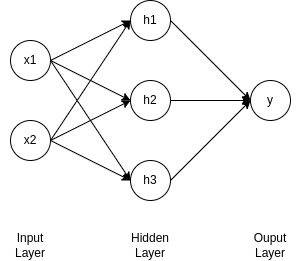

In this post, I built a [**Simple Neural Network for XOR made in Python from Scratch** ](https://github.com/T-Kalv/Simple-Neural-Network/tree/main) without any external Machine Learning Libraries/Frameworks such as PyTorch or Tensorflow or JAX.

### Why XOR?
XOR (exclusive OR) is a binary logic gate operation that takes two binary inputs (0 or 1) and produces a single output (0 or 1). Here in XOR, the ouput of the operation is equal to 1 if and only if both the inputs are different (not the same inputs). If both inputs are the same, then the ouput is 0.

I chose XOR specifically as it's the simplest problem to solve for a Neural Network as a single-layer perceptron cannot solve for XOR because the data is not linearly separable. Neural Networks can solve non-linear separable problems by adding hidden layers between the input and output which allows them to learn complex, non-linear decision boundaries such as XOR.

### Neural Network:

The Neural network consits of 2 inputs, 3 neurons in the hidden layer which apply the non-linear transformation in this case the sigmoid activation function and in the output layer there is 1 neuron which gives one number between 0 and 1 which represent the predicted probability.

### Training Neural Network:

The Training process consited of 4*2 matrix of all possible combinations of two binary inputs which is XOR function. These were:
- (0,0) -> Expected Output = 0
- (0,1) -> Expected Ouput = 1
- (1,0) -> Expected Output = 1
- (1,1) -> Expected Ouput = 0

The goal of the Training the Neural Network was to adjust the weights/biases so that the the output for each of the inputs correspond to the expected output for XOR.

The main steps for Training the Neural Network are as follows:
1. Forward Propagation - inputs and biases are passed through the Neural Network to generate an output. This invlvec calulating the weighted sums as each of the layers from the input layer, through the hidden layer to the output layer, applying the sigmoid activation function and obtaining the Output Predicition.
2. Backpropagation - calulate the error loss between the prediction output and the expected output using the Mean Squared Error Loss (MSE) Function. Then calulate the gradient of the loss with respect to the weights/biases which results in how much each of those weights/biases cotributed to the error. Adjust weights/biases according to error contribtion.
3. Sigmoid Activation Function - introduce non-linearity to the Neural Network: 
$$
 \sigma(x) = \frac{1}{1 + e^{-x}} 
$$
4. MSE (Mean Squared Error) Loss Function - 
$$
MSE = \frac{1}{n} \sum_{i=1}^{n} (y_{\text{pred}} - y_{\text{true}})^2
$$

### Results:
After Training the Neural Network 10000 epochs with a rate of learing of 0.1, it was observed that it trained for 0.5556039810180664 seconds. This resulted in:

### Results:

After training the Neural Network for **10,000 epochs** with a learning rate of **0.1**, the training process took **0.5556 seconds**. During training, the model adjusted the weights and biases to minimize the loss, and the predictions gradually became more accurate. This resulted in Raw Prections (Before Rounding) and Predicted Classes (After Rounding).

**Raw Predictions (Before Rounding):**

| Input (x1, x2) | Raw Predicted Output      |
|----------------|---------------------------|
| (0, 0)         | 0.05917951                |
| (0, 1)         | 0.95001299                |
| (1, 0)         | 0.9500065                 |
| (1, 1)         | 0.05039647                |

**Predicted Classes (After Rounding):**

| Input (x1, x2) | Predicted Output (After Rounding) | Expected Output |
|----------------|----------------------------|-----------------|
| (0, 0)         | 0                          | 0               |
| (0, 1)         | 1                          | 1               |
| (1, 0)         | 1                          | 1               |
| (1, 1)         | 0                          | 0               |

### Conclusion:

In conclusion, this [**Simple Neural Network for XOR made in Python from Scratch** ](https://github.com/T-Kalv/Simple-Neural-Network/tree/main)* successfully learnt the XOR function without any external Machine Learning Libraries/Frameworks such as PyTorch or Tensorflow or JAX, only using basic principles such as Forward Propagation, Backpropagation, Sigmoid Activation Function and MSE (Mean Squared Error Loss) by adjusting the weights/biases through Backpropagation and reducing the loss over time. This resulted in correctly predicing XOR outputs for the given inputs.

The **Simple Neural Network for XOR made in Python from Scratch** source code can be accessed via [GitHub](https://github.com/T-Kalv/Simple-Neural-Network/tree/main)

